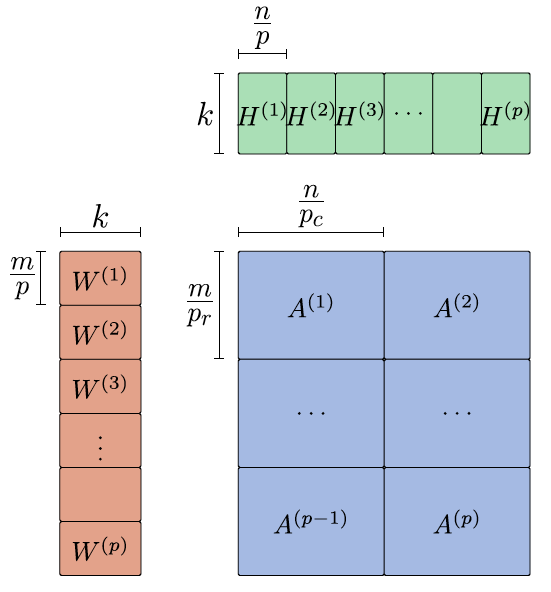

Distributed NMFk Experiments
=============================
Experiments for Test cases
-----------------------------------
For **data1,data2,...,data10** example datasets in data/ directory use _**launchscript.sh**_
````
sh launchscript.sh
````
The required dataset to run can be specified in the script in _matname_ variable.

- This split data in 2d grid as shown below, if the processor grid needs to be changed, note that Pr should be divisible by m, Pc should be divisible by n.
- A job on one node is submitted to perform distnmfk on the benchmark dataset. Once the job is completed, use the postprocessing.sh to extract the necessary files and plots.
````
sh postprocessing.sh "${PWD}/Results_${matname}/"
````
i.e. if the dataset you wish to run is data1
````
sh postprocessing.sh "${PWD}/Results_data1/"
````

The above script does the following

- [ ] Extract the necessary files containing 1. 'Avg_sil.csv' 2. 'Min_sil.csv' 3. 'Relerr_Avg.csv' in Results_${matname}/ directory

- [ ] Plots the results and saves it into png in Results_${matname}/ directory

Experiments for Swimmer Data
-----------------------------------
For **Swimmer** example dataset in data/ directory use _**launchscript_swimmer.sh**_
````
sh launchscript_swimmer.sh
````
- A job on eight nodes is submitted to perform distnmfk on the benchmark dataset. 
Once the job is completed, use the postprocessing.sh to extract the necessary files and plots.

````
sh postprocessing.sh "${PWD}/Results_swim/"
````

The above script does the following

- [ ] Extract the necessary files containing 1. 'Avg_sil.csv' 2. 'Min_sil.csv' 3. 'Relerr_Avg.csv' in Results_$swim/ directory

- [ ] Plots the results and saves it into png in Results_$swim/ directory


MoreDetails (Inside the scripts)
=================================

Pre Processing (Input to Distnmfk)
-----------------------------------

This current version reads the input of the original data, split based on the processor grid.
1d and 2d procssor grid splitting can be done using the file _split_data_2d.py_
````
matname="data4"
pr=16
pc=16
python split_data_2d.py "data/${matname}.mat" $pr $pc "Results_${matname}/"
````


Running Distnmfk on the splitdata
---------------------------------
Script involving the slurm scheduler job script and distnmfk execution is given in _launchscript.sh_ and _run_Datamats.sh_ and is submitted using the command
````
pr=16
pc=16
m=1024
n=256
sbatch run_Datamats.sh ${PWD}/Results_${matname}/ 1 $pr $pc $m $n
```` 
_**General running instructions and parameters**_
````
mpirun -np p "distnmfk" -a $i -k $k -i "random" -t $j -d "240 180" -p "$pr $pc" -o "nmfout_${out}" -r "0.001 0 0.001 0" -e 1 
````
````
p : Number of Processors/cores
a : algorithm
k : For k, rank of NMF
i : input type or data location
t : Number of iterations
d : Dimensions of the matrix to be decomposed
o : directory to produce output files
e : Flag to print relative error 
````
Post Processing (After Distnmfk completion)
------------------------------------------
use _postprocessing.sh _ to collect silhouettes and relative error after distnmfk decomposition
````
python collectsil.py "${PWD}/Results_${matname}/"
python collectrel.py "${PWD}/Results_${matname}/"
````

Plotting Results
------------------------------------
Use the function _plot_results.py_ to plot the collected Silhouette widths and Relative error using 
````
python plot_results.py "${PWD}/Results_${matname}/" "${matname}"

````

This is the example figure obtained for data1 in benchmark datasets


Output interpretation
======================
For W matrix row major ordering. That is., W_0, W_1, .., W_p
For H matrix column major ordering. That is., for 6 processes
with pr=3, pc=2, interpret as H_0, H_2, H_4, H_1, H_3, H_5


Citation:
=========

If you are using this implementation, kindly cite.

<div class="csl-entry">Chennupati, G., Vangara, R., Skau, E., Djidjev, H., &amp; Alexandrov, B. (2020). Distributed non-negative matrix factorization with determination of the number of latent features. <i>The Journal of Supercomputing</i>, <i>76</i>(9), 7458–7488. <a href="https://doi.org/10.1007/s11227-020-03181-6">https://doi.org/10.1007/s11227-020-03181-6</a></div>
  <span class="Z3988" title="url_ver=Z39.88-2004&amp;ctx_ver=Z39.88-2004&amp;rfr_id=info%3Asid%2Fzotero.org%3A2&amp;rft_id=info%3Adoi%2F10.1007%2Fs11227-020-03181-6&amp;rft_val_fmt=info%3Aofi%2Ffmt%3Akev%3Amtx%3Ajournal&amp;rft.genre=article&amp;rft.atitle=Distributed%20non-negative%20matrix%20factorization%20with%20determination%20of%20the%20number%20of%20latent%20features&amp;rft.jtitle=The%20Journal%20of%20Supercomputing&amp;rft.stitle=J%20Supercomput&amp;rft.volume=76&amp;rft.issue=9&amp;rft.aufirst=Gopinath&amp;rft.aulast=Chennupati&amp;rft.au=Gopinath%20Chennupati&amp;rft.au=Raviteja%20Vangara&amp;rft.au=Erik%20Skau&amp;rft.au=Hristo%20Djidjev&amp;rft.au=Boian%20Alexandrov&amp;rft.date=2020-09&amp;rft.pages=7458-7488&amp;rft.spage=7458&amp;rft.epage=7488&amp;rft.issn=0920-8542%2C%201573-0484&amp;rft.language=en"></span>
